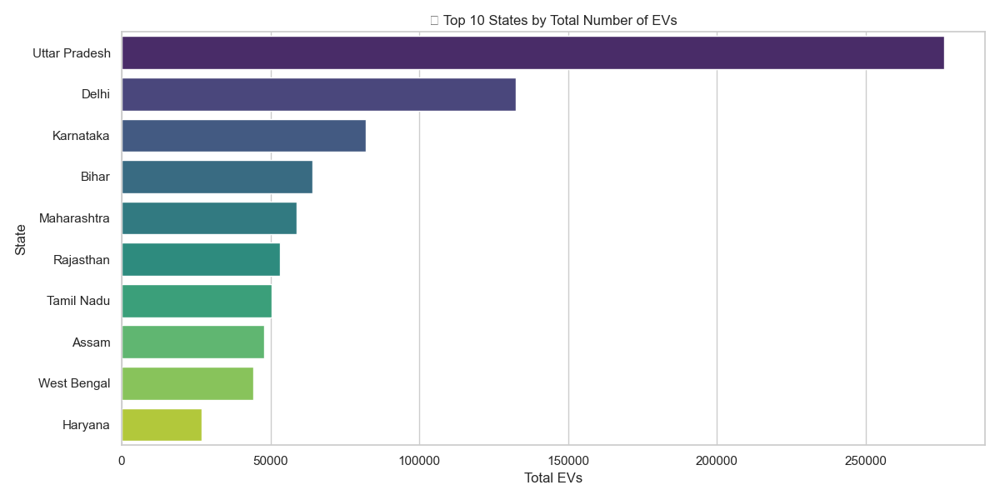
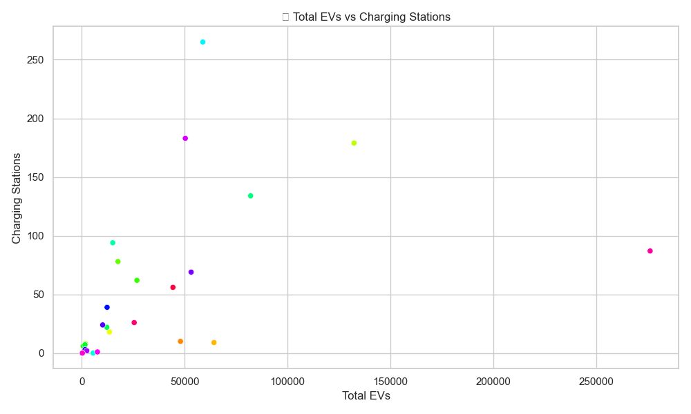
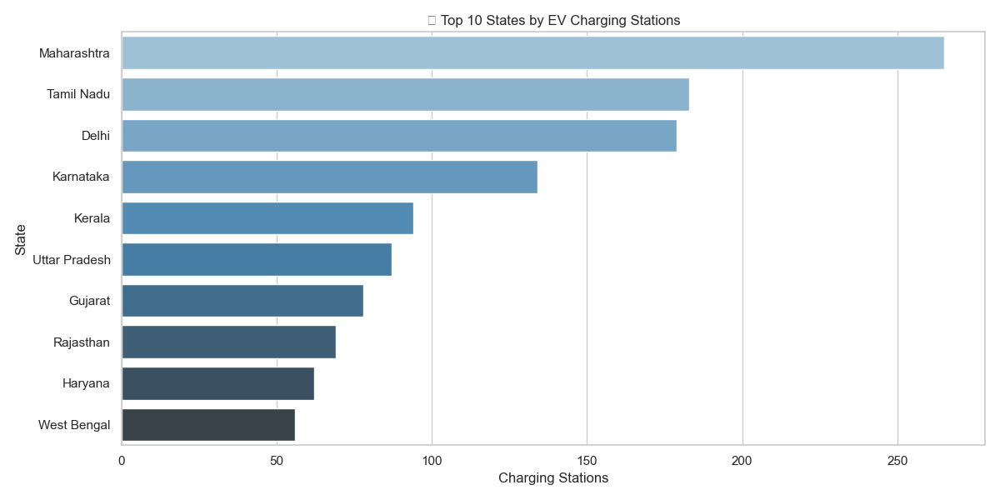
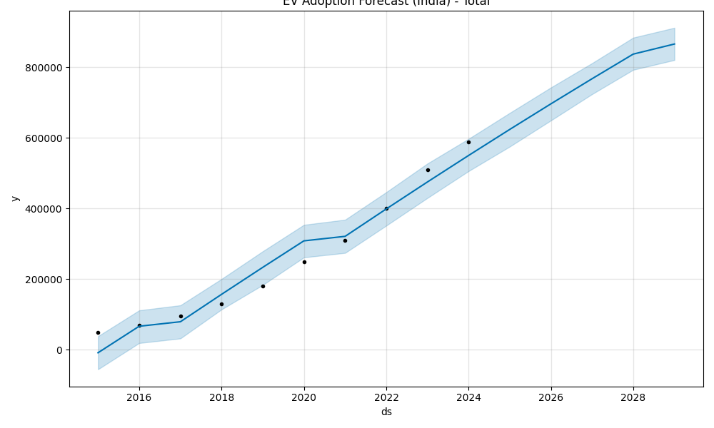
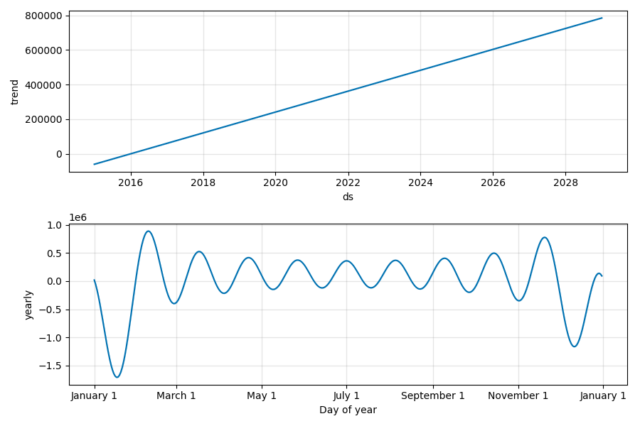
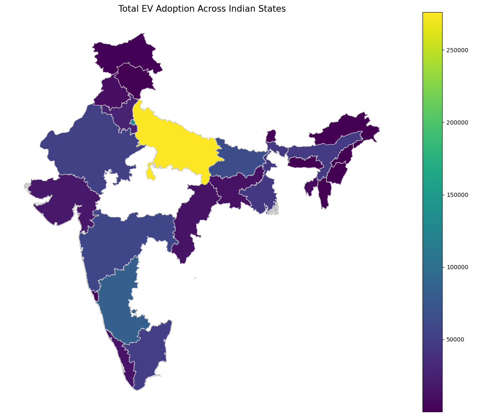
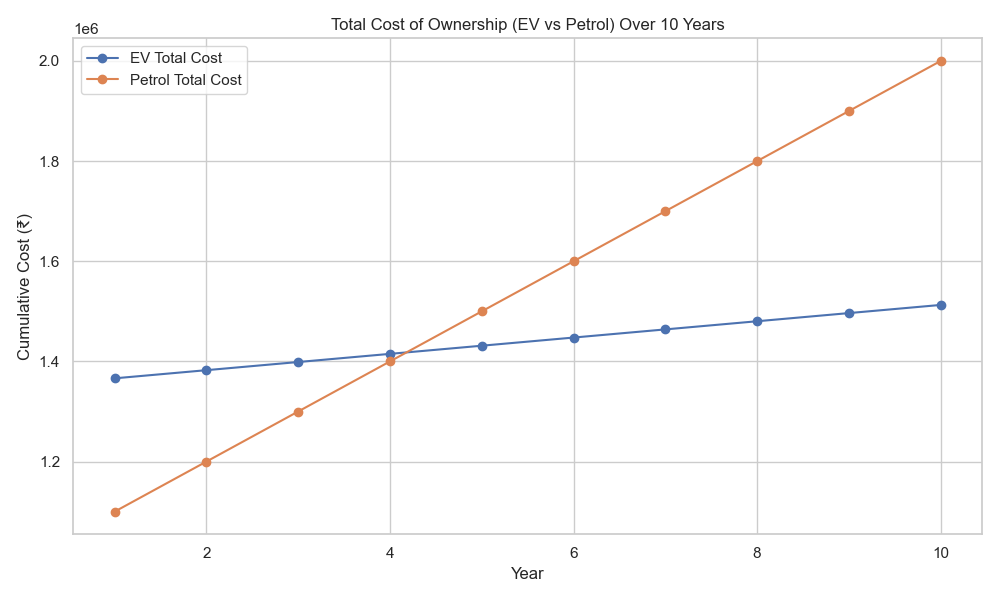
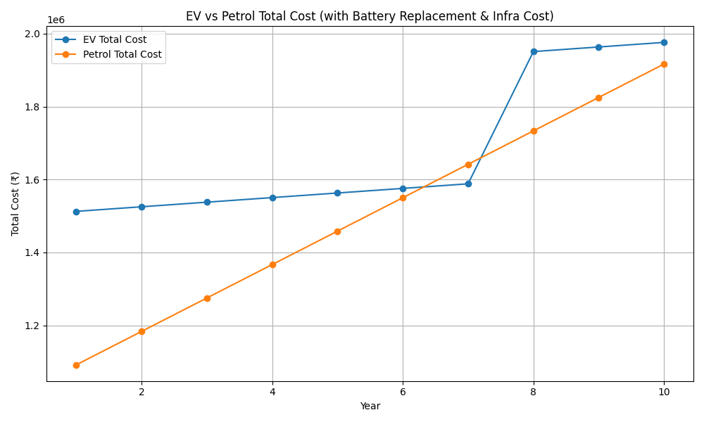

# ⚡ Electric Vehicle (EV) Adoption Impact Analysis - India

## 📊 Project Overview

This end-to-end data analytics project explores **Electric Vehicle (EV) adoption trends across Indian states**, combining multiple datasets, geospatial mapping, forecasting, and cost-benefit analysis. The goal is to support **infrastructure planning**, **policy decisions**, and **consumer awareness** by leveraging data-driven insights.

---

## 🚀 Key Objectives

- Analyze state-wise EV adoption patterns.
- Identify which **vehicle types** dominate the market.
- Forecast future EV growth using **time series models** (Prophet).
- Map **charging station availability** using geospatial data.
- Evaluate **realistic cost-benefit** of owning an EV over a petrol vehicle.

---

## 🧰 Tools & Technologies

| Tool            | Purpose                          |
|-----------------|----------------------------------|
| **Python**      | Core scripting and analysis      |
| **Pandas**      | Data cleaning and manipulation   |
| **Seaborn, Matplotlib** | Visualizations          |
| **Prophet**     | Time series forecasting          |
| **GeoPandas, Folium** | Geospatial mapping       |
| **Jupyter / PowerShell** | Script execution       |
| **Git & GitHub**| Version control and publishing   |

---

## 🧾 Project Structure

```
ev_adoption/
│
├── cleaned_ev_state_data.csv              # Final cleaned dataset
├── requirements.txt                       # All Python dependencies
├── step2_data_load.py                     # Data loading and inspection
├── step3_data_cleaning.py                 # Handling missing values
├── step4_eda.py                           # Exploratory Data Analysis
├── step5_forecasting.py                   # EV growth forecasting using Prophet
├── step6_geospatial_map.py                # Static & interactive charging station maps
├── step7_cost_benefit.py                  # 10-year ownership cost analysis
│
├── map_ev_adoption.png                    # Static heatmap
├── map_charging_stations.html            # Interactive folium map
├── fig_ev_by_state.png                    # Top 10 states by EVs
├── fig_ev_type_distribution.png          # EV type bar chart
├── fig_charging_distribution.png         # Charging station vs EV barplot
│
└── README.md                              # You are here
```

---

## 📈 Key Visualizations
## 📈 Key Visualizations

### 🔹 EV Adoption by State


### 🔹 EV Type Distribution


### 🔹 Charging Station Distribution


---

## 🔮 Forecasting EV Growth
Forecast generated using Prophet to project India's EV count for the next 3 years.



---

## 🌍 Geospatial Insights

### Static Map - EV Adoption


### Interactive Map - Charging Stations
👉 [Click to view interactive HTML map](./map_charging_stations.html)

---

## 💰 Cost-Benefit Analysis

10-year total cost comparison of an EV vs Petrol car (₹ per km).

### Simplified Model


### Realistic Model (includes battery replacement and charging infra access)

---

## 🌐 Geospatial Mapping

- **Static Map**: Highlights EV concentration by state.
- **Interactive Map**: Hoverable state-wise **charging station** distribution.

🖼️ `map_ev_adoption.png`  
🌍 `map_charging_stations.html`

---

## 💸 Cost-Benefit Analysis

A 10-year ownership cost comparison of **EV vs Petrol vehicle**, with realistic assumptions:

| Factor | Value |
|--------|-------|
| EV Cost | ₹15,00,000 |
| Petrol Cost | ₹10,00,000 |
| Battery Replacement (Year 7) | ₹2,50,000 |
| Charging Cost/Year | ₹18,000 |
| Petrol Cost/Year | ₹72,000 |

### ✅ Result:
- **Break-even Year**: Year 7  
- **Total Savings in 10 Years**: **₹-59,333** (Loss)  

> ⚠️ Due to battery replacement and limited charging access, EV ownership becomes beneficial **only after year 7** under these assumptions.

---

## 📌 Key Insights

- **Delhi, UP, Bihar, Karnataka** lead EV adoption.
- **Three-wheelers and two-wheelers** dominate the EV market.
- Many states with **high EV numbers lack charging infrastructure**.
- **Forecasting indicates steep growth**, but charging infra is **not keeping pace**.
- Realistic cost-benefit varies based on usage, battery cost, and power access.

---

## 🔧 How to Run Locally

```bash
# Create virtual environment (optional but recommended)
python -m venv venv
venv\Scripts ctivate     # Windows

# Install all libraries
pip install -r requirements.txt

# Run analysis
python step2_data_load.py
python step3_data_cleaning.py
python step4_eda.py
python step5_forecasting.py
python step6_geospatial_map.py
python step7_cost_benefit.py
```

---

## 📌 Future Scope

- Add **city-level data** for more granular planning.
- Integrate **real-time charging availability APIs**.
- Develop a **dashboard in Power BI or Streamlit**.
- Incorporate **government subsidy impact** in cost models.

---

## 📬 Author

**Arul Thakur**  
🔗 [GitHub](https://github.com/arulthakur123)  
📫 Reach out for collaborations or feedback!

---
